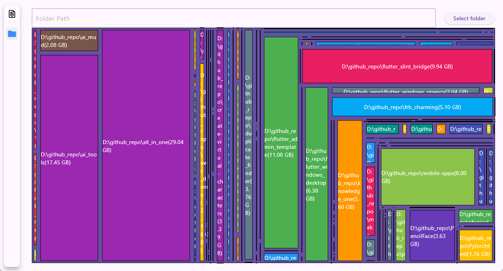

# scanner

a simple tool to search files or folders

## changelog

* 2.1.0 (unreleased):
  
  * inspect child folder

* 2.0.0:
  
  * caculate folder size and draw treemap

    
  
* 1.2.2:
  * add progress bar

* 1.2.1 (unreleased):
  * hash function changed

* 1.2.0 (unreleased):
  * refactor rust `Event`

* 1.1.1+1 (unreleased):
  * add some callbacks
  * performance improvement
  * add `PaginatorController`

* 1.1.1: 
  * remove item from list when remove button clicked

* 1.1.0 (unreleased): 
  * add `remove` and `openfile` button

* 1.0.0: initial release
